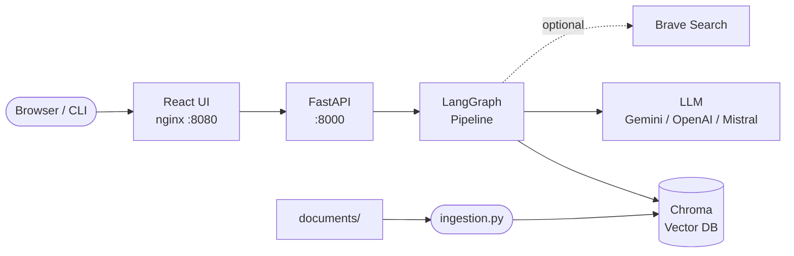
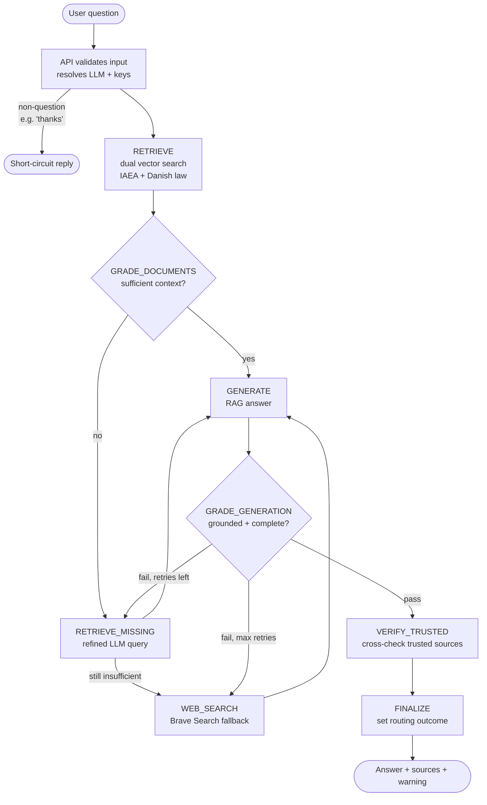

# Radiation Safety RAG


[](https://github.com/eikrad/Radiationsafety/actions/workflows/ci.yml)

A RAG (Retrieval-Augmented Generation) system for querying IAEA and Danish radiation safety documents. Ask questions in plain language and get cited answers sourced directly from official standards and legislation.

**Documents covered:**
- IAEA standards and guidelines (GSR, SSG, SSR, TECDOC series)
- Danish radiation legislation (*Bekendtgørelse*, fetched from retsinformation.dk)

---

## How it works

User questions flow through a [LangGraph](https://langchain-ai.github.io/langgraph/) pipeline that retrieves relevant document chunks, grades them for sufficiency, generates an answer, checks it for grounding, and optionally falls back to a web search — all before returning a response with cited sources.

**Stack at a glance:**



**RAG pipeline:**



See [docs/architecture.md](docs/architecture.md) for a deeper breakdown of each node and chain.

---

## Quick start with Docker

The simplest way to run the full stack.

**Prerequisites:** Docker, a `GOOGLE_API_KEY` (required for embeddings).

```bash
# 1. Configure environment
cp .env.example .env
# Edit .env — set GOOGLE_API_KEY and optionally LLM_PROVIDER + its key

# 2. Start the stack
docker compose up --build

# 3. In a second terminal, run ingestion once (fills the vector DB)
docker compose run --rm backend python ingestion.py
# Wait until it finishes, then restart the stack:
docker compose restart backend
```

Open **http://localhost:8080** — the UI is served there, with the API proxied from the same origin.

The vector DB is stored in a named Docker volume (`chroma_data`), so ingestion only needs to run once per environment. Re-run it after adding new documents.

---

## Local setup (without Docker)

### 1. Prerequisites

- Python 3.12+, [uv](https://docs.astral.sh/uv/) package manager
- Node.js 18+ (for the frontend)
- A `GOOGLE_API_KEY` — required for embeddings (always Gemini, regardless of which LLM you choose for generation)

### 2. Configure environment

```bash
cp .env.example .env
```

Key variables:

| Variable | Required | Description |
|---|---|---|
| `GOOGLE_API_KEY` | **Yes** | Gemini embeddings (ingestion + retrieval) |
| `LLM_PROVIDER` | No | `gemini` (default) \| `openai` \| `mistral` |
| `OPENAI_API_KEY` | If using OpenAI | For generation only |
| `MISTRAL_API_KEY` | If using Mistral | For generation only |
| `WEB_SEARCH_ENABLED` | No | `true` to enable Brave Search fallback |
| `BRAVE_SEARCH_API_KEY` | If web search on | Required for Brave Search |
| `ADMIN_TOKEN` | Recommended | Required for document management routes |

See `.env.example` for the full list including rate limiting and tracing options.

### 3. Install and ingest

```bash
# Install Python dependencies
uv sync

# (Optional) Build document_sources.yaml from local PDFs
uv run python build_document_sources.py

# Run ingestion — builds the Chroma vector DB
uv run python ingestion.py
```

Ingestion loads PDFs from `documents/IAEA/`, `documents/IAEA_other/`, and `documents/Bekendtgørelse/`, plus any URLs listed in `document_sources.yaml`. Danish sources are fetched as XML from retsinformation.dk (newest version of the series). You only need to run ingestion once; changing `LLM_PROVIDER` does **not** require re-ingestion.

### 4. Start the backend

```bash
uv run uvicorn api.main:app --reload --port 8000
```

### 5. Start the frontend

```bash
# Build once (served by the backend at http://localhost:8000)
npm -C frontend run build

# Or run in dev mode with hot reload (http://localhost:5173)
npm -C frontend install && npm -C frontend run dev
```

### 6. (Optional) CLI mode

```bash
uv run python main.py
```

---

## Document management

The **Documents** panel in the UI lets you check for newer versions of registered sources and re-run ingestion without touching the command line. The backend polls retsinformation.dk and the IAEA publication pages to detect when a document has been superseded.

To register document sources manually, edit `document_sources.yaml` (or run `build_document_sources.py` to generate it from local PDFs). The file is gitignored by default so you can keep environment-specific URLs locally; remove the gitignore entry to commit a shared registry.

---

## Evaluation

The evaluation harness in `eval/` runs the pipeline on a golden Q&A dataset and scores outputs with RAGAS-style metrics (faithfulness, answer relevance, context precision, context recall).

```bash
uv run python -m eval.run_eval
```

Reports are written to `eval/reports/`. See `eval/README.md` for options such as `--limit` and `--no-web-search`.

---

## Testing

- **Backend:** `uv run pytest tests/ -v`
- **Frontend:** `cd frontend && npm run test`

CI runs both suites on every push and pull request.

---

## Security and operations

- Mutating routes (`/ingest`, document management) require an `X-Admin-Token` header.
- If `ADMIN_TOKEN` is not set, admin routes return `503` (fail-closed). Set `ADMIN_AUTH_BYPASS=true` only for local development.
- Rate limiting is in-memory by default; set `RATE_LIMIT_BACKEND=redis` for multi-replica deployments.
- The backend container runs as a non-root user with `no-new-privileges` and all Linux capabilities dropped.

See [docs/production-readiness.md](docs/production-readiness.md) for the full security and operations reference.

---

## Further reading

| File | Contents |
|---|---|
| [docs/architecture.md](docs/architecture.md) | RAG pipeline nodes, chains, and ingestion workflow |
| [docs/production-readiness.md](docs/production-readiness.md) | Security, rate limiting, observability |
| [CONTRIBUTING.md](CONTRIBUTING.md) | Development setup, code quality, PR process |
| [ROADMAP.md](ROADMAP.md) | Planned evaluation improvements |

---

## Credits

Inspired by patterns from the **LangChain / LangGraph course** by [Eden Marco](https://github.com/emarco177/langchain-course) (Apache-2.0).

Thanks to [Roman Kuznetsov (@kuznero)](https://github.com/kuznero) for valuable feedback on the project.
