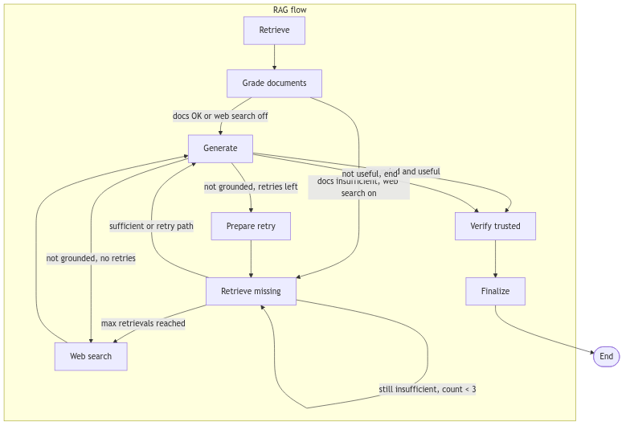

# Radiation Safety RAG


[](https://github.com/eikrad/Radiationsafety/actions/workflows/ci.yml)

RAG system for querying IAEA and Danish radiation safety documents. See [CONTRIBUTING.md](CONTRIBUTING.md) for development setup and guidelines.

## Architecture

The query flow is implemented as a [LangGraph](https://langchain-ai.github.io/langgraph/) state graph: retrieval from the vector store, optional document grading and extra retrieval, optional web-search fallback, generation, grounding check with retries, and trusted-source verification.



Diagram source: `architecture.mmd` (Mermaid). To regenerate: `uv run python scripts/render_architecture.py`.

## Running with Docker

The image does not ship the vector DB (`.chroma` is too large for the repo). Run ingestion once, then use the app.

1. Copy `.env.example` to `.env` and set `LLM_PROVIDER` and the matching API key (`GOOGLE_API_KEY` or `MISTRAL_API_KEY`); the same keys are used for ingestion.
2. From the project root:
   ```bash
   docker compose up --build
   ```
3. In another terminal, run ingestion once (fills the persisted `chroma_data` volume):
   ```bash
   docker compose run --rm backend python ingestion.py
   ```
   Wait for it to finish, then stop the stack (`Ctrl+C`) and start again with `docker compose up` so the backend loads the new DB.
4. Open **http://localhost:8080** for the UI. The frontend proxies `/api` to the backend.

The backend uses a named volume `chroma_data` for `.chroma`, so you only need to run ingestion once per environment. To refresh the document base (e.g. after changing `LLM_PROVIDER`), run the ingestion command again.

## Setup

1. Copy `.env.example` to `.env` and configure:
   - `LLM_PROVIDER`: `gemini` or `mistral`
   - `GOOGLE_API_KEY` or `MISTRAL_API_KEY` (depending on provider)
   - Optional: `WEB_SEARCH_ENABLED=true`, `BRAVE_SEARCH_API_KEY` for fallback; `WEB_SEARCH_TRUSTED_DOMAINS_ONLY=true` to restrict web search to iaea.org/retsinformation.dk/sst.dk (default is unrestricted; answers are still verified against trusted sources)
   - Optional: `LANGCHAIN_API_KEY` for LangSmith tracing (tracing is auto-disabled when API keys are sent from the frontend to avoid leaking keys to LangSmith)

2. Install dependencies:
   ```bash
   uv sync
   ```

3. **(Optional)** Document sources: copy `document_sources.example.yaml` to `document_sources.yaml` and add URLs, or **build the list from local PDFs** (see “Building document_sources.yaml from local PDFs” below). `document_sources.yaml` is gitignored by default so you can keep local or repo-specific URLs; remove that line from `.gitignore` if you want to commit a shared registry. The **Documents** button in the UI checks for updates (e.g. retsinformation.dk “Senere ændringer”, IAEA “Superseded by”) When you re-run ingestion, Danish sources always use the **newest** version of the series; the registry file is updated with that URL. Older Danish versions are kept in `documents/backup/Bekendtgørelse` (at most 2 per source).

4. Run ingestion (requires API key for embeddings):
   ```bash
   uv run python ingestion.py
   ```
   **If you switch `LLM_PROVIDER`** (e.g. from mistral to gemini), re-run full ingestion so the vector store is rebuilt with the new embedding model (Mistral and Gemini use different embedding dimensions).
   Ingestion loads **(1) local PDFs** from `documents/IAEA`, `documents/IAEA_other`, `documents/Bekendtgørelse`, and **(2) documents from URLs** listed in `document_sources.yaml`: **Danish** sources are fetched as **XML** from retsinformation.dk (newest version of the series), IAEA sources from the publication page PDF link, and any direct PDF URLs. You can rely entirely on the registry and skip placing PDFs locally. Use the **Documents** panel in the UI to "Check for updates" and “Re-run ingestion”.

5. Start backend:
   ```bash
   uv run uvicorn api.main:app --reload --port 8000
   ```

6. Frontend – from project root, choose one:
   - **Single server**: `npm -C frontend run build` then open http://localhost:8000
   - **Dev mode** (hot reload): `npm -C frontend install && npm -C frontend run dev` then open http://localhost:5173

7. Optional CLI:
   ```bash
   uv run python main.py
   ```

## Evaluation

The evaluation harness lives in **`eval/`**. It runs the RAG graph on a golden Q&A dataset and scores outputs with RAGAS-style metrics (faithfulness, answer relevance, context precision, context recall), writing markdown and JSON reports to `eval/reports/`.

From the project root:

```bash
uv run python -m eval.run_eval
```

The harness uses your `.env` for the LLM (no API keys in the golden data). Run ingestion first so the graph has documents to retrieve. See `eval/README.md` for options (`--limit`, `--no-web-search`), metric definitions, and optional LangSmith tracing.

## Testing

CI runs the test suite on push and on pull requests (see status badge above).

- **Backend**: `uv pip install -e ".[dev]"` then `uv run pytest tests/ -v`
- **Frontend**: `cd frontend && npm run test` (or `npm run test:watch` for watch mode)

## Building document_sources.yaml from local PDFs

To populate `document_sources.yaml` from the PDFs you already have in `documents/`:

```bash
uv run python build_document_sources.py
```

This scans `documents/IAEA`, `documents/IAEA_other`, and `documents/Bekendtgørelse`, extracts titles and version info from PDF metadata and first-page text (and from Danish `*_version.txt` files), optionally confirms Danish ELI URLs on retsinformation.dk, merges with any existing registry entries (to keep URLs), and writes the full list to `document_sources.yaml`. Use `--no-confirm` to skip URL lookups, or `--dry-run` to print the list without writing.

## Collections

- `radiation-iaea`: IAEA and IAEA_other PDFs
- `radiation-dk-law`: Bekendtgørelse (Danish legislation), ingested from retsinformation.dk XML (newest version)

## Credits and references

This project was inspired by and draws on patterns from the **LangChain / LangGraph course** by **Eden Marco** and the accompanying open-source repository:

- **Eden Marco** – [LangChain course](https://github.com/emarco177/langchain-course) (GitHub)
- Repository: [github.com/emarco177/langchain-course](https://github.com/emarco177/langchain-course) (Apache-2.0)

We thank [Roman Kuznetsov (@kuznero)](https://github.com/kuznero) for valuable comments on the project.
