# Radiation Safety RAG


[](https://github.com/eikrad/Radiationsafety/actions/workflows/ci.yml)

Ask questions in natural language about IAEA radiation safety standards and Danish radiation legislation. The system retrieves relevant document chunks from a vector database, grades their quality, generates a grounded answer, and verifies it against trusted sources — with an optional web search fallback when the local corpus does not cover the question.

Intended for radiation safety professionals, researchers, and regulators who need quick, cited answers from a curated set of authoritative documents.

**Document corpus:** IAEA General Safety Requirements (GSR 1–7), Safety Guides (SSG series), transport regulations (SSR-6), TECDOCs, and Danish Bekendtgørelser fetched live from retsinformation.dk. See [Collections and embeddings](#collections-and-embeddings) for the full list.

---

## Architecture

The pipeline has two stages: an API pre-processing stage and a [LangGraph](https://langchain-ai.github.io/langgraph/) execution stage. The API validates inputs, short-circuits non-question acknowledgements, resolves provider/API-key settings, and then invokes the graph for retrieval, document grading, optional extra retrieval and web-search fallback, generation, grounding retries, and trusted-source verification.



Diagram source: `architecture.mmd` (Mermaid). To regenerate: `uv run python scripts/render_architecture.py`.

---

## Running with Docker

The image does not ship the vector DB (`.chroma` is too large for the repo). Run ingestion once, then use the app.

1. Copy `.env.example` to `.env`. Set **`GOOGLE_API_KEY`** (required for ingestion and retrieval). Optionally set `LLM_PROVIDER` and the matching key for generation (`GOOGLE_API_KEY`, `MISTRAL_API_KEY`, or `OPENAI_API_KEY`).
2. Build and start the stack:
   ```bash
   docker compose up --build
   ```
3. In another terminal, run ingestion once (fills the persisted `chroma_data` volume):
   ```bash
   docker compose run --rm backend python ingestion.py
   ```
   Wait for it to finish, then restart with `docker compose up` so the backend loads the populated DB.
4. Open **http://localhost:8080**. The frontend proxies `/api` to the backend.

The backend uses a named volume `chroma_data` for `.chroma`, so you only need to run ingestion once per environment. To refresh the document base after adding new sources, run the ingestion command again. Changing `LLM_PROVIDER` does not require re-running ingestion.

---

## Local Setup

1. **Configure environment** — copy `.env.example` to `.env`:
   - **`GOOGLE_API_KEY`** (required): used for Gemini embeddings during ingestion and at query time. Set this even if you use OpenAI or Mistral for answer generation.
   - **`LLM_PROVIDER`** — `gemini`, `mistral`, or `openai`. Set the matching key (`OPENAI_API_KEY` or `MISTRAL_API_KEY`). The vector store stays on Gemini embeddings regardless.
   - Optional: `WEB_SEARCH_ENABLED=true` + `BRAVE_SEARCH_API_KEY` for fallback web search; `WEB_SEARCH_TRUSTED_DOMAINS_ONLY=true` to restrict to iaea.org / retsinformation.dk / sst.dk.
   - Optional: `LANGCHAIN_API_KEY` for LangSmith tracing (auto-disabled when API keys are forwarded from the frontend).

2. **Install dependencies:**
   ```bash
   uv sync
   ```

3. **Document registry** (optional) — copy `document_sources.example.yaml` to `document_sources.yaml` and add source URLs, or generate from local PDFs (see [Building document_sources.yaml](#building-document_sourcesyaml-from-local-pdfs)). The file is gitignored by default; remove that line if you want to commit a shared registry.

4. **Run ingestion** (requires `GOOGLE_API_KEY`):
   ```bash
   uv run python ingestion.py
   ```
   Ingestion loads **(1) local PDFs** from `documents/IAEA`, `documents/IAEA_other`, `documents/Bekendtgørelse`, and **(2) documents from URLs** in `document_sources.yaml`: Danish sources are fetched as XML from retsinformation.dk (newest version of the series), IAEA sources from the publication page, and any direct PDF URLs. You only need to run ingestion once per document set.

5. **Start the backend:**
   ```bash
   uv run uvicorn api.main:app --reload --port 8000
   ```

6. **Start the frontend** — from the project root, choose one:
   - **Single server:** `npm -C frontend run build` then open http://localhost:8000
   - **Dev mode** (hot reload): `npm -C frontend install && npm -C frontend run dev` then open http://localhost:5173

7. **Optional CLI:**
   ```bash
   uv run python main.py
   ```

---

## Collections and Embeddings

Two Chroma collections are maintained:

- **`radiation-iaea`** — IAEA and IAEA_other PDFs
- **`radiation-dk-law`** — Bekendtgørelse (Danish legislation), ingested as XML from retsinformation.dk (always the newest version of each series)

**Current corpus:**

| Collection | Documents |
|---|---|
| IAEA | GSR-1, GSR-2, GSR-3, GSR-4, GSR-5, GSR-6, GSR-7, SSG-11, SSG-39, SSG-40, SSG-44, SSG-46, SSG-86, SSG-87, SSR-6, TECDOC-1380, TECDOC-1638, Nuclear Safety Measures (24G) |
| Danish | BEK-2025-138405, BEK-2025-138505, Brug af åbne radioaktive kilder, Udarbejdelse af en sikkerhedsvurdering |

Retrieval always uses **Gemini embeddings**. The LLM that generates answers can be Gemini, OpenAI, or Mistral — changing the generation provider does not require re-ingestion, since the LLM only receives retrieved text, not the embedding vectors.

---

## Building document_sources.yaml from local PDFs

To populate `document_sources.yaml` from PDFs already in `documents/`:

```bash
uv run python build_document_sources.py
```

This scans `documents/IAEA`, `documents/IAEA_other`, and `documents/Bekendtgørelse`, extracts titles and version info from PDF metadata, optionally confirms Danish ELI URLs on retsinformation.dk, merges with any existing registry entries, and writes the result to `document_sources.yaml`. Use `--no-confirm` to skip URL lookups, or `--dry-run` to preview without writing.

---

## Evaluation

The evaluation harness lives in **`eval/`**. It runs the RAG graph on a golden Q&A dataset and scores outputs with RAGAS-style metrics (faithfulness, answer relevance, context precision, context recall), writing markdown and JSON reports to `eval/reports/`.

```bash
uv run python -m eval.run_eval
```

The harness uses your `.env` for the LLM (no API keys in the golden data). Run ingestion first so the graph has documents to retrieve. See `eval/README.md` for options (`--limit`, `--no-web-search`, `--pass-rule`), metric definitions, and optional LangSmith tracing.

---

## Testing

CI runs the full test suite on push and on pull requests (see status badge above).

- **Backend:** `uv run pytest tests/ -v`
- **Frontend:** `npm -C frontend run test` (or `npm -C frontend run test:watch` for watch mode)

See [CONTRIBUTING.md](CONTRIBUTING.md) for development setup and code quality guidelines.

---

## Security and Operations

- Mutating routes (`/ingest` and mutating `/documents/*` endpoints) require an `X-Admin-Token` header.
- If `ADMIN_TOKEN` is not configured, admin routes are fail-closed (`503`) unless `ADMIN_AUTH_BYPASS=true` is explicitly set for local-only use.
- Query/admin rate limits are in-memory and per-client (`RATE_LIMIT_*`). For multi-worker or multi-replica deployments, set `RATE_LIMIT_BACKEND=redis` and `RATE_LIMIT_REDIS_URL` to enforce global limits.
- Every HTTP response includes `X-Request-ID` for correlation. Prometheus-style metrics are available at `/metrics`.

See [docs/production-readiness.md](docs/production-readiness.md) for the full route exposure matrix, rate limit knobs, and observability baseline.

### Container hardening

- Backend runs as a non-root user (`appuser`) with `PYTHONDONTWRITEBYTECODE=1` and `PYTHONUNBUFFERED=1`.
- Compose applies `no-new-privileges` and drops all Linux capabilities for backend and frontend containers.
- Backend uses `tmpfs` for `/tmp` and a named volume only for `/app/.chroma`.
- Healthchecks are active; the frontend waits for a healthy backend before starting.

### Runbook quick checks

| Symptom | Check |
|---|---|
| 429 spike | Verify `RATE_LIMIT_*` values and recent traffic patterns |
| Admin routes return 503 | Check `ADMIN_TOKEN` is set and `ADMIN_AUTH_BYPASS` is not accidentally enabled |
| Service health degraded | Inspect `/health`, `/metrics`, and container health in Compose |

---

## Credits and References

This project was inspired by and draws on patterns from the **LangChain / LangGraph course** by **Eden Marco**:

- **Eden Marco** — [LangChain course](https://github.com/emarco177/langchain-course) (GitHub, Apache-2.0)

We thank [Roman Kuznetsov (@kuznero)](https://github.com/kuznero) for valuable comments on the project.
