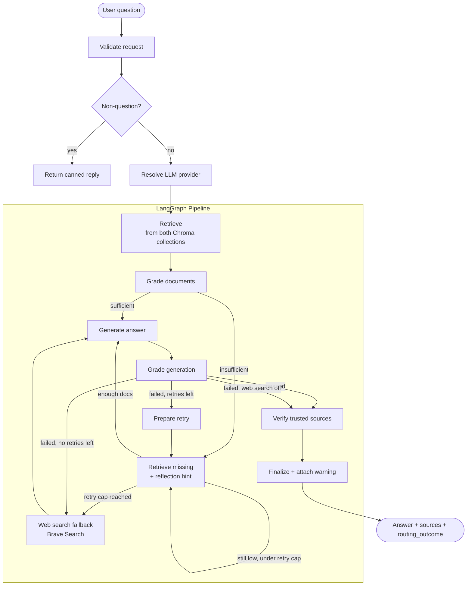
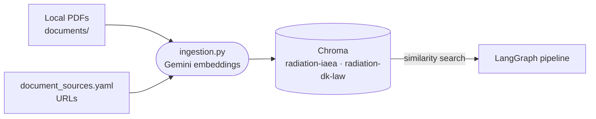

# Radiation Safety RAG


[](https://github.com/eikrad/Radiationsafety/actions/workflows/ci.yml)

Ask questions about IAEA nuclear safety standards and Danish radiation legislation in plain language. The system retrieves the most relevant chunks from a local vector database, grades them, generates a grounded answer, and flags anything it cannot verify.

## Features

- **RAG over IAEA and Danish sources** — covers IAEA GSR, SSG, SSR, TECDOC standards and Danish Bekendtgørelser
- **Multi-provider LLM** — choose Gemini, OpenAI, Mistral, or fully-local Ollama (privacy mode, zero data leaves your machine)
- **Grounded answers** — every answer is verified against retrieved source documents; unverified web results are flagged
- **Web search fallback** — Brave Search kicks in when local documents don't cover the query
- **Document management UI** — check for updated versions of source documents and re-ingest from the browser
- **Docker-ready** — compose setup with persistent Chroma volume; run ingestion once and you're done
- **Evaluation harness** — RAGAS-style scoring (faithfulness, relevance, precision, recall) against a golden Q&A dataset

## How it works


```mermaid
flowchart TB
    USER([User question]) --> VALIDATE[Validate request]
    VALIDATE --> NONQ{Non-question?}
    NONQ -->|yes| QUICK_REPLY[Return canned reply]
    NONQ -->|no| MODEL[Resolve LLM provider]

    subgraph GRAPH [LangGraph Pipeline]
        direction TB
        RETRIEVE[Retrieve\nfrom both Chroma collections]
        GRADE[Grade documents]
        RETRIEVE_MISSING[Retrieve missing\n+ reflection hint]
        WEB_SEARCH[Web search fallback\nBrave Search]
        GENERATE[Generate answer]
        GRADE_GEN[Grade generation]
        PREPARE_RETRY[Prepare retry]
        VERIFY[Verify trusted sources]
        FINALIZE[Finalize + attach warning]
    end

    MODEL --> RETRIEVE
    RETRIEVE --> GRADE
    GRADE -->|sufficient| GENERATE
    GRADE -->|insufficient| RETRIEVE_MISSING
    RETRIEVE_MISSING -->|enough docs| GENERATE
    RETRIEVE_MISSING -->|still low, under retry cap| RETRIEVE_MISSING
    RETRIEVE_MISSING -->|retry cap reached| WEB_SEARCH
    WEB_SEARCH --> GENERATE
    GENERATE --> GRADE_GEN
    GRADE_GEN -->|passed| VERIFY
    GRADE_GEN -->|failed, retries left| PREPARE_RETRY
    PREPARE_RETRY --> RETRIEVE_MISSING
    GRADE_GEN -->|failed, no retries left| WEB_SEARCH
    GRADE_GEN -->|failed, web search off| VERIFY
    VERIFY --> FINALIZE
    FINALIZE --> RESPONSE([Answer + sources + routing_outcome])
```

See [docs/architecture.md](docs/architecture.md) for a full walkthrough of every node, chain, ingestion workflow, and API routes.

## Tech Stack

| Layer | Technology |
|-------|------------|
| Backend API | FastAPI + Python |
| AI pipeline | LangGraph + LangChain |
| Embeddings | Google Gemini (always required) |
| LLM for answers | Gemini / OpenAI / Mistral / Ollama (configurable via `LLM_PROVIDER`) |
| Vector database | Chroma |
| Document processing | Docling HybridChunker |
| Frontend | React + TypeScript (Vite) |
| Container | Docker + Docker Compose |

## Documentation

| File | What it covers |
|------|----------------|
| [docs/architecture.md](docs/architecture.md) | Pipeline nodes, chains, ingestion workflow, LLM providers, API routes — with Mermaid diagrams |
| [docs/production-readiness.md](docs/production-readiness.md) | Security, admin auth, rate limiting, container hardening, and runbook |
| [docs/maintenance.md](docs/maintenance.md) | Dependency upgrade notes and document update procedures |

## Ingestion overview

Documents are embedded once into a local Chroma database. The same vector store is reused for all queries — changing which LLM generates answers does **not** require re-ingestion.


```mermaid
flowchart LR
    PDFS[Local PDFs\ndocuments/] --> INGEST
    URLS[document_sources.yaml\nURLs] --> INGEST
    INGEST([ingestion.py\nGemini embeddings]) --> CHROMA
    CHROMA[(Chroma\nradiation-iaea · radiation-dk-law)] -->|similarity search| PIPELINE[LangGraph pipeline]
```

`GOOGLE_API_KEY` is required to run ingestion. See [docs/architecture.md](docs/architecture.md) for the full ingestion and document-update workflow.

## Running with Docker

The image does not ship the vector DB (`.chroma` is too large for the repo). Run ingestion once, then use the app.

1. Copy `.env.example` to `.env`. Set **`GOOGLE_API_KEY`** (required for ingestion and retrieval). Optionally set `LLM_PROVIDER` and the matching key for generation (`GOOGLE_API_KEY`, `MISTRAL_API_KEY`, or `OPENAI_API_KEY`).
2. Start the stack:
   ```bash
   docker compose up --build
   ```
3. Run ingestion once (fills the persisted `chroma_data` volume):
   ```bash
   docker compose run --rm backend python ingestion.py
   ```
4. Open **http://localhost:8080** for the UI. The frontend proxies `/api` to the backend.

The `chroma_data` volume persists between restarts — you only need to run ingestion once per environment. Changing `LLM_PROVIDER` does not require re-ingestion.

## Setup (local)

1. Copy `.env.example` to `.env` and configure:
   - **`GOOGLE_API_KEY`** — required for all cloud providers (Gemini embeddings are always used for retrieval)
   - **`LLM_PROVIDER`** — `gemini` (default), `openai`, `mistral`, or `ollama`; set the matching API key
   - Optional: `WEB_SEARCH_ENABLED=true` + `BRAVE_SEARCH_API_KEY` for web search fallback
   - Optional: `LANGCHAIN_API_KEY` for LangSmith tracing

2. Install dependencies:
   ```bash
   uv sync
   ```

3. Run ingestion (one-time; requires `GOOGLE_API_KEY`):
   ```bash
   uv run python ingestion.py
   ```
   Changing `LLM_PROVIDER` later does **not** require re-running ingestion — the same Gemini-embedded vector store is used for retrieval regardless of which model generates answers.

4. Start the backend:
   ```bash
   uv run uvicorn api.main:app --reload --port 8000
   ```

5. Start the frontend (choose one):
   - **Single server**: `npm -C frontend run build` then open http://localhost:8000
   - **Dev mode** (hot reload): `npm -C frontend install && npm -C frontend run dev` → http://localhost:5173

6. Optional CLI:
   ```bash
   uv run python main.py
   ```

### Document sources

Copy `document_sources.example.yaml` to `document_sources.yaml` to register source URLs for automatic fetching and update checking. Or build the registry from local PDFs already in `documents/`:

```bash
uv run python build_document_sources.py
```

The **Documents** panel in the UI lets you check for newer versions (retsinformation.dk, IAEA) and trigger re-ingestion without leaving the browser. Danish sources are always fetched as the newest version of the series; older versions are backed up to `documents/backup/Bekendtgørelse/`.

## Privacy Mode (Fully Local)

All LLM generation and embeddings run locally via [Ollama](https://ollama.com). Zero data leaves your machine — LangSmith tracing and web search are automatically disabled.

### Minimum system requirements

| Component | Minimum | Recommended |
|-----------|---------|-------------|
| GPU | 4 GB VRAM (CPU fallback works but slow) | 6 GB+ VRAM (e.g. NVIDIA RTX 3060) |
| RAM | 16 GB | 32 GB |
| Disk | ~5 GB (models + vector DB) | ~10 GB |
| OS | Linux, macOS, or Windows | Linux (best Ollama performance) |

### Setup

1. Install Ollama:
   ```bash
   curl -fsSL https://ollama.com/install.sh | sh
   ```
2. Pull models:
   ```bash
   ollama pull llama3.1:8b
   ollama pull nomic-embed-text
   ```
3. Set `LLM_PROVIDER=ollama` in `.env`
4. Run ingestion (one-time, builds local embedding collections):
   ```bash
   uv run python ingestion.py
   ```
5. Start backend and frontend as usual, select **Ollama (Local)** in the UI dropdown.

Local collections (`radiation-iaea-ollama`, `radiation-dk-law-ollama`) coexist with the cloud Gemini collections. Switching back to a cloud provider reuses the original collections without re-ingesting.

## Evaluation

The evaluation harness lives in `eval/`. It runs the RAG pipeline against a golden Q&A dataset and scores outputs with RAGAS-style metrics (faithfulness, answer relevance, context precision, context recall), writing reports to `eval/reports/`.

```bash
uv run python -m eval.run_eval
```

Run ingestion first so the graph has documents to retrieve. See `eval/README.md` for options (`--limit`, `--no-web-search`) and optional LangSmith tracing.

## Testing

CI runs the test suite on push and on pull requests (see badge above).

- **Backend**: `uv pip install -e ".[dev]"` then `uv run pytest tests/ -v`
- **Frontend (unit)**: `cd frontend && npm run test` (or `npm run test:watch` for watch mode)
- **Frontend (E2E)**: `cd frontend && npx playwright install --with-deps chromium && npm run test:e2e` — UI-only Playwright tests against a mocked API (see `frontend/e2e/`)

## Security

- Admin routes (`/ingest` and mutating `/documents/*` endpoints) require `X-Admin-Token`.
- Without `ADMIN_TOKEN` configured, admin routes are fail-closed (`503`). Set `ADMIN_AUTH_BYPASS=true` only for local-only development.
- Rate limiting is in-memory per-client by default; switch to Redis for multi-worker deployments (`RATE_LIMIT_BACKEND=redis`).

See [docs/production-readiness.md](docs/production-readiness.md) for the full runbook, rate limiting config, container hardening details, and observability setup.

## Vector collections

| Collection | Content | Embeddings |
|---|---|---|
| `radiation-iaea` | IAEA standards and TECDOC documents | Gemini |
| `radiation-dk-law` | Danish Bekendtgørelser (retsinformation.dk XML) | Gemini |
| `radiation-iaea-ollama` | Same content | Ollama local |
| `radiation-dk-law-ollama` | Same content | Ollama local |

Cloud providers (Gemini, OpenAI, Mistral) all use the Gemini-embedded collections. The LLM for generation only receives retrieved text — never the raw vectors. Switching the generation provider requires no re-ingestion.

## Contributing

Contributions are welcome. See [CONTRIBUTING.md](CONTRIBUTING.md) for dev setup, code style, and pull request guidelines.

## License

Licensed under the [Apache License 2.0](LICENSE). See [NOTICE](NOTICE) for third-party attributions.

## Credits and references

This project was inspired by and draws on patterns from the **LangChain / LangGraph course** by **Eden Marco**:
- Repository: [github.com/emarco177/langchain-course](https://github.com/emarco177/langchain-course) (Apache-2.0)

We thank [Roman Kuznetsov (@kuznero)](https://github.com/kuznero) for valuable comments on the project.
