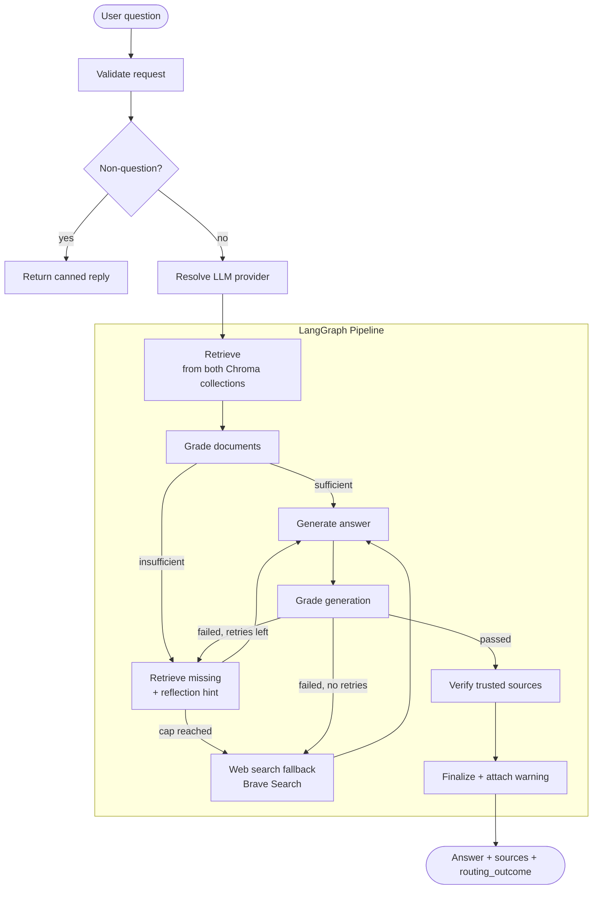

# Radiation Safety RAG


[](https://github.com/eikrad/Radiationsafety/actions/workflows/ci.yml)

Ask questions about IAEA nuclear safety standards and Danish radiation legislation in plain language. The system retrieves relevant document chunks from a local vector database, grades them, generates a grounded answer, and flags anything it cannot verify.

## Features

- **RAG over IAEA and Danish sources** — covers IAEA GSR, SSG, SSR, TECDOC standards and Danish Bekendtgørelser
- **Multi-provider LLM** — choose Gemini, OpenAI, Mistral, or fully-local Ollama (zero data leaves your machine)
- **Grounded answers** — every answer is verified against retrieved source documents; unverified web results are flagged
- **Web search fallback** — Brave Search kicks in when local documents don't cover the query
- **Document management UI** — check for updated versions of source documents and re-ingest from the browser
- **Docker-ready** — compose setup with persistent Chroma volume; run ingestion once and you're done
- **Evaluation harness** — RAGAS-style scoring (faithfulness, relevance, precision, recall) against a golden Q&A dataset

## How it works


```mermaid
flowchart TB
    USER([User question]) --> VALIDATE[Validate request]
    VALIDATE --> NONQ{Non-question?}
    NONQ -->|yes| QUICK_REPLY[Return canned reply]
    NONQ -->|no| MODEL[Resolve LLM provider]

    subgraph GRAPH [LangGraph Pipeline]
        direction TB
        RETRIEVE[Retrieve\nfrom both Chroma collections]
        GRADE[Grade documents]
        RETRIEVE_MISSING[Retrieve missing\n+ reflection hint]
        WEB_SEARCH[Web search fallback\nBrave Search]
        GENERATE[Generate answer]
        GRADE_GEN[Grade generation]
        VERIFY[Verify trusted sources]
        FINALIZE[Finalize + attach warning]
    end

    MODEL --> RETRIEVE
    RETRIEVE --> GRADE
    GRADE -->|sufficient| GENERATE
    GRADE -->|insufficient| RETRIEVE_MISSING
    RETRIEVE_MISSING --> GENERATE
    RETRIEVE_MISSING -->|cap reached| WEB_SEARCH
    WEB_SEARCH --> GENERATE
    GENERATE --> GRADE_GEN
    GRADE_GEN -->|passed| VERIFY
    GRADE_GEN -->|failed, retries left| RETRIEVE_MISSING
    GRADE_GEN -->|failed, no retries| WEB_SEARCH
    VERIFY --> FINALIZE
    FINALIZE --> RESPONSE([Answer + sources + routing_outcome])
```

See [docs/architecture.md](docs/architecture.md) for a full walkthrough of every node, chain, ingestion workflow, and API routes.

## Documentation

| File | What it covers |
|------|----------------|
| [docs/architecture.md](docs/architecture.md) | Pipeline nodes, chains, ingestion workflow, LLM providers (incl. Ollama / privacy mode), API routes — with Mermaid diagrams |
| [docs/production-readiness.md](docs/production-readiness.md) | Security, admin auth, rate limiting, container hardening, and runbook |
| [docs/maintenance.md](docs/maintenance.md) | Dependency upgrade notes and document update procedures |

## Quick start with Docker

The fastest way to run. No local Python environment needed.

1. Copy `.env.example` to `.env`. Set `GOOGLE_API_KEY` (required for embeddings). Optionally set `LLM_PROVIDER` and the matching key.

2. Start the stack:
   ```bash
   docker compose up --build
   ```

3. Run ingestion once to fill the vector database:
   ```bash
   docker compose run --rm backend python ingestion.py
   ```

4. Open **http://localhost:8080**. The frontend proxies `/api` to the backend.

Chroma data lives in a named volume (`chroma_data`) — you only need to run ingestion once. Changing `LLM_PROVIDER` does not require re-ingestion.

## Local setup

1. Copy `.env.example` to `.env` and fill in your API keys (see the file for all options).
2. Install dependencies: `uv sync`
3. Run ingestion (one-time, requires `GOOGLE_API_KEY`): `uv run python ingestion.py`
4. Start backend: `uv run uvicorn api.main:app --reload --port 8000`
5. Start frontend: `npm -C frontend install && npm -C frontend run dev` → open http://localhost:5173

Optional CLI: `uv run python main.py`

## LLM providers

| Provider | Set in `.env` | Notes |
|---|---|---|
| `gemini` (default) | `GOOGLE_API_KEY` | Gemini 2.5 Pro / Flash — also used for embeddings |
| `openai` | `OPENAI_API_KEY` | gpt-4o-mini / gpt-4o |
| `mistral` | `MISTRAL_API_KEY` | Mistral default model |
| `ollama` | — | Fully local — no data leaves your machine |

Cloud providers (Gemini, OpenAI, Mistral) all use **Gemini embeddings** for retrieval. Switching the generation LLM does not require re-ingestion. For Ollama setup and hardware requirements, see [docs/architecture.md](docs/architecture.md#privacy-mode-fully-local-ollama).

## Privacy mode (Ollama)

Run completely offline with no API keys required:

```bash
# Install Ollama and pull models
ollama pull llama3.1:8b
ollama pull nomic-embed-text

# Set LLM_PROVIDER=ollama in .env, then run ingestion once
uv run python ingestion.py
```

Start the backend and frontend as usual and select **Ollama (Local)** in the UI dropdown. See [docs/architecture.md](docs/architecture.md#privacy-mode-fully-local-ollama) for hardware requirements and notes on answer quality vs. cloud providers.

## Evaluation

```bash
uv run python -m eval.run_eval
```

Reports are written to `eval/reports/`. See `eval/README.md` for options (`--limit`, `--no-web-search`) and metric definitions.

## Testing

```bash
# Backend
uv run pytest tests/ -v

# Frontend
npm -C frontend run test
```

CI runs the test suite on push and on pull requests (see status badge above).

## Credits

- [Eden Marco](https://github.com/emarco177) — LangGraph patterns from [langchain-course](https://github.com/emarco177/langchain-course) (Apache-2.0)
- [Roman Kuznetsov (@kuznero)](https://github.com/kuznero) — valuable comments on the project
