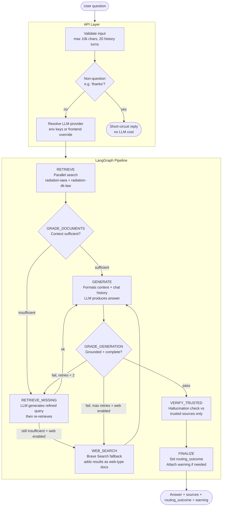
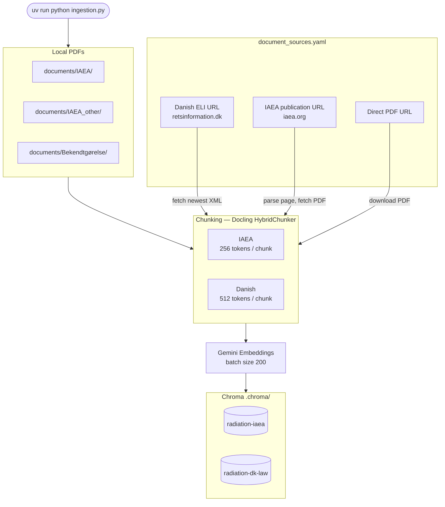
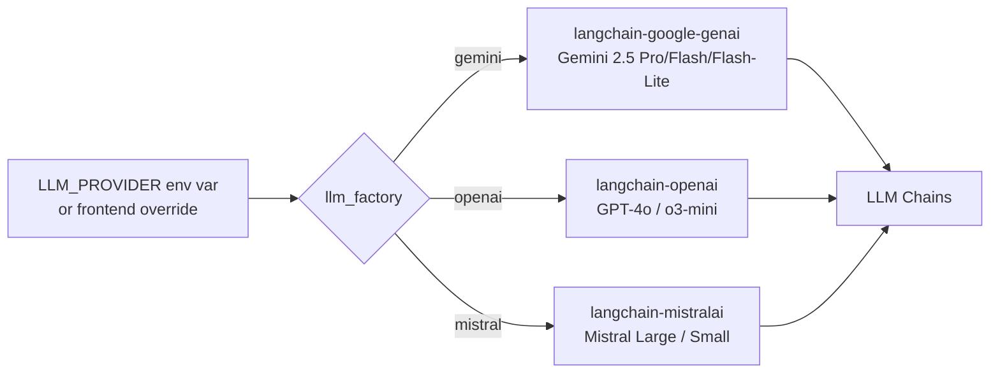

# Architecture

This document describes how the Radiation Safety RAG system is structured — from a user query arriving at the API to an answer being returned with cited sources.

---

## Overview

The system has three main layers:

1. **API** (`api/main.py`) — validates inputs, enforces rate limits, resolves LLM provider, and invokes the graph.
2. **LangGraph pipeline** (`graph/`) — a stateful workflow of retrieval, grading, generation, and verification nodes.
3. **Vector database** (Chroma, `.chroma/`) — stores document chunks embedded with Gemini embeddings.

The frontend (`frontend/`) is a React/TypeScript chat UI that calls the API.

---

## Query workflow



### Routing outcomes

The `routing_outcome` field in the response tells you which path the query took:

| Outcome | Meaning |
|---|---|
| `trusted_only_verified` | Answer grounded in vector DB documents only |
| `web_search_unverified` | Web search was used; answer may not be fully grounded |
| `web_search_verified` | Web search used, but answer verified against trusted sources |
| `trusted_supplemented` | Trusted sources supplemented the web answer |

---

## LangGraph nodes

Each node is a Python function `(state: GraphState) -> dict` in `graph/nodes/`.

| Node | File | What it does |
|---|---|---|
| `RETRIEVE` | `retrieve.py` | Parallel vector search on both Chroma collections |
| `GRADE_DOCUMENTS` | `grade_documents.py` | Asks LLM: is the retrieved context sufficient? |
| `RETRIEVE_MISSING` | `retrieve_missing.py` | LLM generates a targeted query; re-retrieves |
| `GENERATE` | `generate.py` | Formats context + chat history; calls generation chain |
| `GRADE_GENERATION` | `grade_generation.py` | Checks answer is grounded and complete |
| `WEB_SEARCH` | `web_search.py` | Brave Search → appends results as extra documents |
| `VERIFY_TRUSTED` | `verify_trusted.py` | Hallucination check against trusted-source docs only |
| `FINALIZE` | *(inline in graph.py)* | Sets `routing_outcome` and user-facing warning |

---

## LLM chains

Chains are factory functions in `graph/chains/` that return a LangChain runnable.

| Chain | File | Output |
|---|---|---|
| `generation` | `generation.py` | Answer text |
| `generation_grader` | `generation_grader.py` | `{passed: bool, missing_info: str}` |
| `context_sufficiency_grader` | `context_sufficiency_grader.py` | `{binary_score: bool}` |
| `hallucinations_grader` | `hallucinations_grader.py` | `{binary_score: bool}` |
| `missing_query_chain` | `missing_query_chain.py` | Refined retrieval query string |
| `search_query_chain` | `search_query_chain.py` | Web search query string |
| `truncate` | `truncate.py` | Truncated document list (fits token budget) |

---

## State

`graph/state.py` defines `GraphState` — a `TypedDict` that flows through the entire pipeline.

Key fields:

| Field | Type | Purpose |
|---|---|---|
| `question` | `str` | Current user question |
| `generation` | `str` | LLM-generated answer |
| `documents` | `list` | Retrieved + web chunks |
| `trusted_documents` | `list` | Vector DB chunks only (for verification) |
| `chat_history` | `list[tuple]` | Previous (question, answer) pairs |
| `web_search` | `bool` | Flag: should web search run? |
| `reflection` | `str` | LLM hint about what was missing (from grader) |
| `routing_outcome` | `str` | Final path taken through the graph |
| `retrieval_warning` | `str` | User-facing warning (language-aware) |

---

## Document ingestion



### Key ingestion facts

- **Embeddings are always Gemini** — `GOOGLE_API_KEY` is required for both ingestion and query time.
- Changing `LLM_PROVIDER` (Gemini / OpenAI / Mistral for *generation*) does **not** require re-ingestion.
- Danish sources are always fetched as XML (not PDF) and updated to the newest version of the series.
- Older Danish versions are kept in `documents/backup/Bekendtgørelse/` (max 2 per source).
- The two Chroma collections (`radiation-iaea`, `radiation-dk-law`) must not be renamed without re-ingesting.

---

## LLM providers

`graph/llm_factory.py` selects the LLM at runtime based on `LLM_PROVIDER`.



The frontend can pass API keys directly (stored in `sessionStorage`, never persisted). When this happens, LangSmith tracing is automatically disabled to prevent key leakage.

---

## API routes

| Method | Path | Auth | Description |
|---|---|---|---|
| `POST` | `/query` | Public | RAG query — main entry point |
| `GET` | `/health` | Public | Health check |
| `GET` | `/metrics` | Public | Prometheus-style counters |
| `GET` | `/config` | Public | Server capabilities (which LLM keys are set) |
| `GET` | `/documents/check-updates` | Public | Check for newer document versions |
| `POST` | `/ingest` | Admin | Trigger full re-ingestion |
| `POST` | `/documents/add-pdf` | Admin | Upload and register a new PDF |
| `PATCH` | `/documents/source/{id}/url` | Admin | Update a source URL manually |

Admin routes require `X-Admin-Token` header. Without `ADMIN_TOKEN` configured, they return `503`.

---

## Adding a new node

1. Create `graph/nodes/my_node.py` — implement `def my_node(state: GraphState) -> dict`.
2. Export it from `graph/nodes/__init__.py`.
3. Add a name constant in `graph/consts.py`.
4. Register in `graph/graph.py`:
   ```python
   workflow.add_node(MY_NODE, my_node)
   workflow.add_edge(SOME_NODE, MY_NODE)
   ```

## Adding a new chain

1. Create `graph/chains/my_chain.py` — implement a `get_my_chain()` factory function.
2. Export from `graph/chains/__init__.py`.
