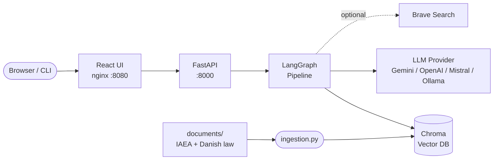
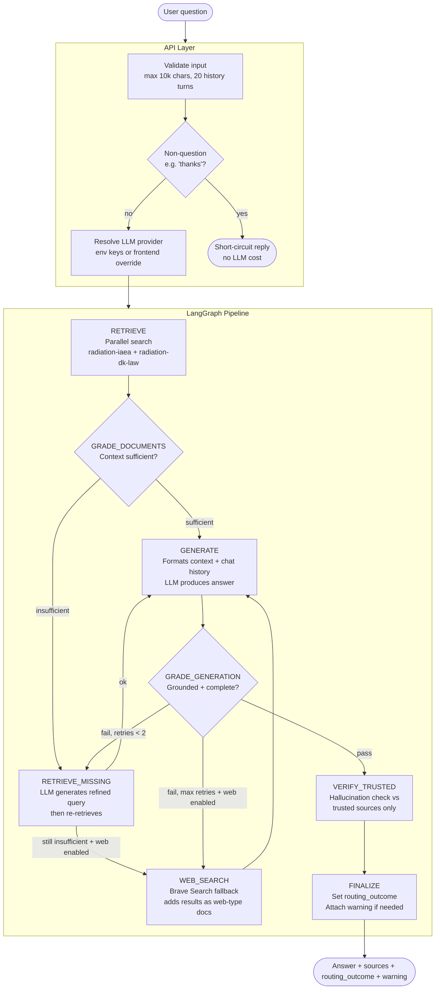
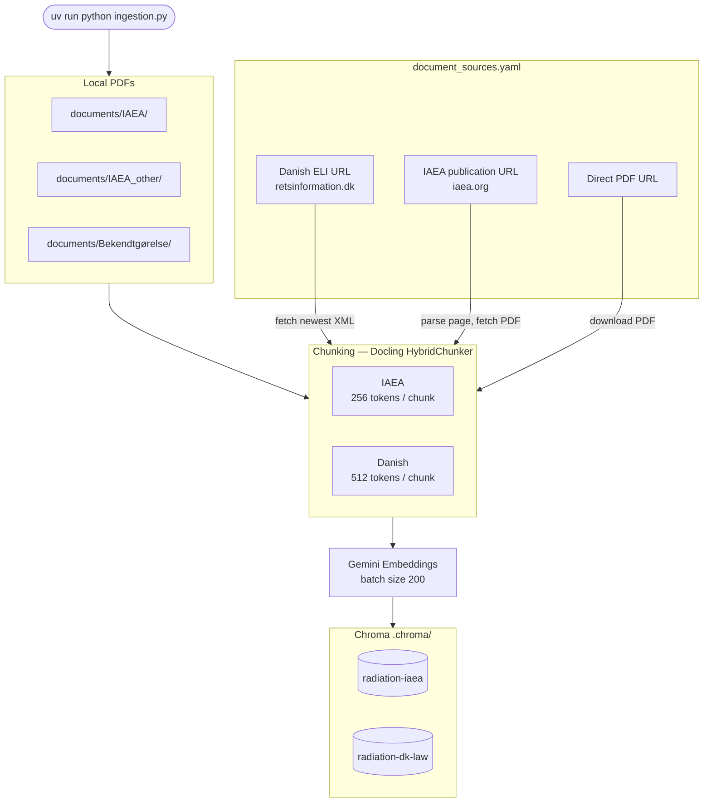
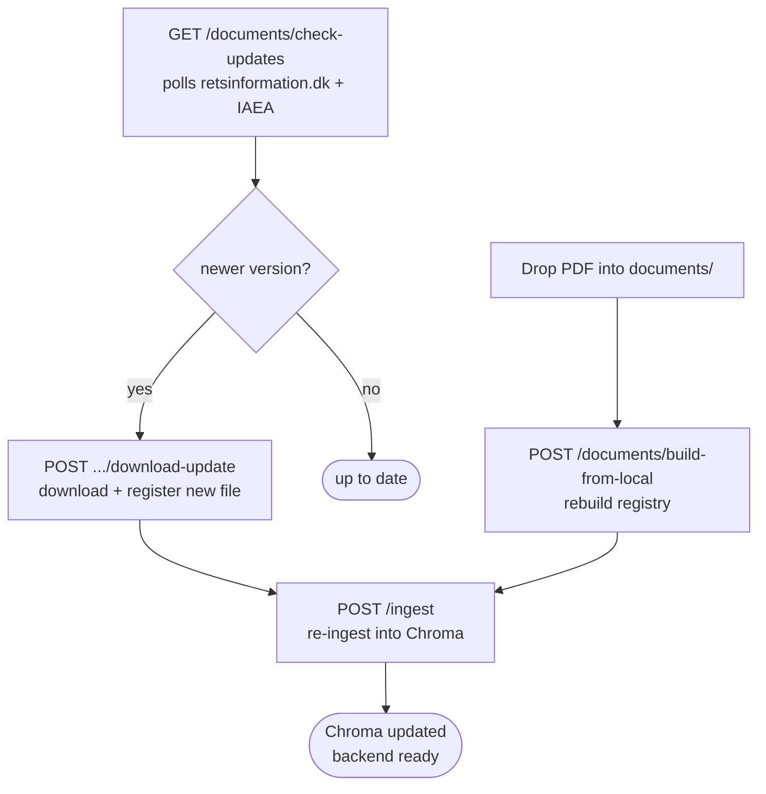
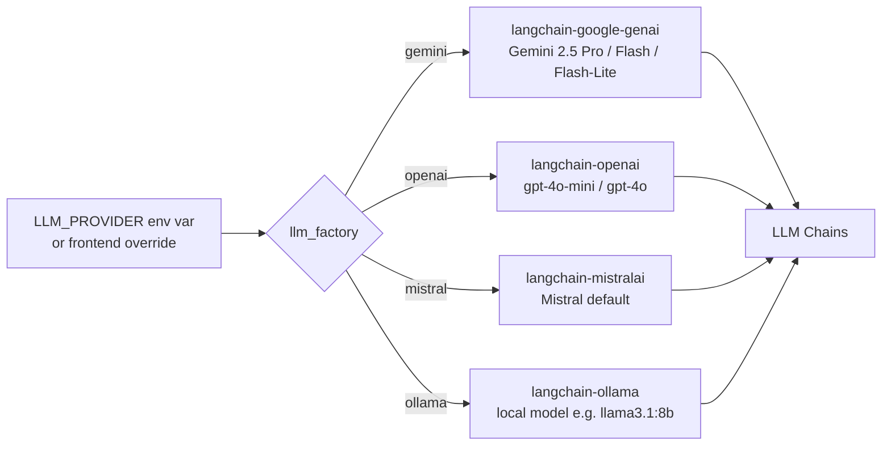
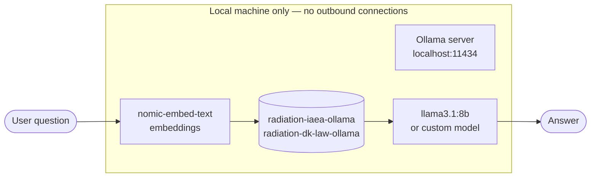

# Architecture

This document describes how the Radiation Safety RAG system is structured — from a user query arriving at the API to an answer being returned with cited sources.

---

## Overview

The system has three main layers:

1. **API** (`api/main.py`) — validates inputs, enforces rate limits, resolves LLM provider, and invokes the graph.
2. **LangGraph pipeline** (`graph/`) — a stateful workflow of retrieval, grading, generation, and verification nodes.
3. **Vector database** (Chroma, `.chroma/`) — stores document chunks embedded with Gemini embeddings (or local embeddings in Ollama mode).

The frontend (`frontend/`) is a React/TypeScript chat UI that calls the API.


```mermaid
graph LR
    USER([Browser / CLI]) --> FE[React UI\nnginx :8080]
    FE --> API[FastAPI\n:8000]
    API --> LG[LangGraph\nPipeline]
    LG --> CHROMA[(Chroma\nVector DB)]
    LG --> LLM[LLM Provider\nGemini / OpenAI / Mistral / Ollama]
    LG -.->|optional| BRAVE[Brave Search]
    INGEST([ingestion.py]) --> CHROMA
    DOCS[documents/\nIAEA + Danish law] --> INGEST
```

---

## Query workflow


```mermaid
flowchart TD
    Q([User question]) --> API

    subgraph API [API Layer]
        direction TB
        V[Validate input\nmax 10k chars, 20 history turns]
        NC{Non-question\ne.g. 'thanks'?}
        RES[Resolve LLM provider\nenv keys or frontend override]
        V --> NC
        NC -->|yes| SC([Short-circuit reply\nno LLM cost])
        NC -->|no| RES
    end

    RES --> GRAPH

    subgraph GRAPH [LangGraph Pipeline]
        direction TB
        R[RETRIEVE\nParallel search\nradiation-iaea + radiation-dk-law]
        GD{GRADE_DOCUMENTS\nContext sufficient?}
        RM[RETRIEVE_MISSING\nLLM generates refined query\nthen re-retrieves]
        WS[WEB_SEARCH\nBrave Search fallback\nadds results as web-type docs]
        GEN[GENERATE\nFormats context + chat history\nLLM produces answer]
        GG{GRADE_GENERATION\nGrounded + complete?}
        VT[VERIFY_TRUSTED\nHallucination check vs\ntrusted sources only]
        FIN[FINALIZE\nSet routing_outcome\nAttach warning if needed]

        R --> GD
        GD -->|sufficient| GEN
        GD -->|insufficient| RM
        RM -->|ok| GEN
        RM -->|still insufficient + web enabled| WS
        WS --> GEN
        GEN --> GG
        GG -->|pass| VT
        GG -->|fail, retries < 2| RM
        GG -->|fail, max retries + web enabled| WS
        VT --> FIN
    end

    FIN --> ANS([Answer + sources + routing_outcome + warning])
```

### Routing outcomes

The `routing_outcome` field in the response tells you which path the query took:

| Outcome | Meaning |
|---|---|
| `trusted_only_verified` | Answer grounded in vector DB documents only |
| `web_search_unverified` | Web search was used; answer may not be fully grounded |
| `web_search_verified` | Web search used, but answer verified against trusted sources |
| `trusted_supplemented` | Trusted sources supplemented the web answer |

---

## LangGraph nodes

Each node is a Python function `(state: GraphState) -> dict` in `graph/nodes/`.

| Node | File | What it does |
|---|---|---|
| `RETRIEVE` | `retrieve.py` | Parallel vector search on both Chroma collections |
| `GRADE_DOCUMENTS` | `grade_documents.py` | Asks LLM: is the retrieved context sufficient? |
| `RETRIEVE_MISSING` | `retrieve_missing.py` | LLM generates a targeted query; re-retrieves |
| `GENERATE` | `generate.py` | Formats context + chat history; calls generation chain |
| `GRADE_GENERATION` | `grade_generation.py` | Checks answer is grounded and complete |
| `WEB_SEARCH` | `web_search.py` | Brave Search → appends results as extra documents |
| `VERIFY_TRUSTED` | `verify_trusted.py` | Hallucination check against trusted-source docs only |
| `FINALIZE` | *(inline in graph.py)* | Sets `routing_outcome` and user-facing warning |

---

## LLM chains

Chains are factory functions in `graph/chains/` that return a LangChain runnable.

| Chain | File | Output |
|---|---|---|
| `generation` | `generation.py` | Answer text |
| `generation_grader` | `generation_grader.py` | `{passed: bool, missing_info: str}` |
| `context_sufficiency_grader` | `context_sufficiency_grader.py` | `{binary_score: bool}` |
| `hallucinations_grader` | `hallucinations_grader.py` | `{binary_score: bool}` |
| `missing_query_chain` | `missing_query_chain.py` | Refined retrieval query string |
| `search_query_chain` | `search_query_chain.py` | Web search query string |
| `truncate` | `truncate.py` | Truncated document list (fits token budget) |

---

## State

`graph/state.py` defines `GraphState` — a `TypedDict` that flows through the entire pipeline.

Key fields:

| Field | Type | Purpose |
|---|---|---|
| `question` | `str` | Current user question |
| `generation` | `str` | LLM-generated answer |
| `documents` | `list` | Retrieved + web chunks |
| `trusted_documents` | `list` | Vector DB chunks only (for verification) |
| `chat_history` | `list[tuple]` | Previous (question, answer) pairs |
| `web_search` | `bool` | Flag: should web search run? |
| `reflection` | `str` | LLM hint about what was missing (from grader) |
| `routing_outcome` | `str` | Final path taken through the graph |
| `retrieval_warning` | `str` | User-facing warning (language-aware) |

---

## Document ingestion


```mermaid
flowchart TD
    START([uv run python ingestion.py]) --> LOCAL

    subgraph LOCAL [Local PDFs]
        direction LR
        IAEA[documents/IAEA/]
        OTHER[documents/IAEA_other/]
        DK[documents/Bekendtgørelse/]
    end

    subgraph REGISTRY [document_sources.yaml]
        direction TB
        DKURL[Danish ELI URL\nretsinformation.dk]
        IAEAURL[IAEA publication URL\niaea.org]
        DIRECT[Direct PDF URL]
    end

    LOCAL --> CHUNK
    DKURL -->|fetch newest XML| CHUNK
    IAEAURL -->|parse page, fetch PDF| CHUNK
    DIRECT -->|download PDF| CHUNK

    subgraph CHUNK [Chunking — Docling HybridChunker]
        direction LR
        C1[IAEA\n256 tokens / chunk]
        C2[Danish\n512 tokens / chunk]
    end

    CHUNK --> EMBED[Gemini Embeddings\nbatch size 200]
    EMBED --> CHROMA

    subgraph CHROMA [Chroma .chroma/]
        COL1[(radiation-iaea)]
        COL2[(radiation-dk-law)]
    end
```

### Key ingestion facts

- **Embeddings are always Gemini** for cloud providers — `GOOGLE_API_KEY` is required for both ingestion and query time. Ollama mode uses local embeddings instead (see [Privacy Mode](#privacy-mode-fully-local-ollama) below).
- Changing `LLM_PROVIDER` (Gemini / OpenAI / Mistral for *generation*) does **not** require re-ingestion.
- Danish sources are always fetched as XML (not PDF) and updated to the newest version of the series.
- Older Danish versions are kept in `documents/backup/Bekendtgørelse/` (max 2 per source).
- The two Chroma collections (`radiation-iaea`, `radiation-dk-law`) must not be renamed without re-ingesting.

### Building document_sources.yaml from local PDFs

To populate `document_sources.yaml` from PDFs you already have in `documents/`:

```bash
uv run python build_document_sources.py
```

This scans `documents/IAEA`, `documents/IAEA_other`, and `documents/Bekendtgørelse`, extracts titles and version info from PDF metadata, optionally confirms Danish ELI URLs on retsinformation.dk, merges with existing registry entries, and writes the full list. Use `--no-confirm` to skip URL lookups, or `--dry-run` to print without writing.

### Updating documents

The Documents panel in the UI (or the admin API) handles the update lifecycle:


```mermaid
flowchart TD
    CHECK[GET /documents/check-updates\npolls retsinformation.dk + IAEA] --> FOUND{newer version?}
    FOUND -->|yes| DL[POST .../download-update\ndownload + register new file]
    FOUND -->|no| DONE([up to date])
    DL --> INGEST[POST /ingest\nre-ingest into Chroma]
    INGEST --> READY([Chroma updated\nbackend ready])

    LOCAL[Drop PDF into documents/] --> BUILD[POST /documents/build-from-local\nrebuild registry]
    BUILD --> INGEST
```

---

## LLM providers

`graph/llm_factory.py` selects the LLM at runtime based on `LLM_PROVIDER`.


```mermaid
flowchart LR
    ENV[LLM_PROVIDER env var\nor frontend override] --> FAC{llm_factory}
    FAC -->|gemini| GEM[langchain-google-genai\nGemini 2.5 Pro / Flash / Flash-Lite]
    FAC -->|openai| OAI[langchain-openai\ngpt-4o-mini / gpt-4o]
    FAC -->|mistral| MIS[langchain-mistralai\nMistral default]
    FAC -->|ollama| OLL[langchain-ollama\nlocal model e.g. llama3.1:8b]
    GEM --> CHAINS[LLM Chains]
    OAI --> CHAINS
    MIS --> CHAINS
    OLL --> CHAINS
```

The frontend can pass API keys directly (stored in `sessionStorage`, never persisted). When this happens, LangSmith tracing is automatically disabled to prevent key leakage.

---

## Privacy Mode (fully local — Ollama)

Setting `LLM_PROVIDER=ollama` switches both LLM generation **and** embeddings to run entirely on local hardware via [Ollama](https://ollama.com). LangSmith tracing and web search are automatically disabled — zero data leaves your machine.


```mermaid
flowchart LR
    subgraph LOCAL [Local machine only — no outbound connections]
        direction TB
        OLLAMA[Ollama server\nlocalhost:11434]
        EMBED[nomic-embed-text\nembeddings]
        LLM_L[llama3.1:8b\nor custom model]
        CHROMA_L[(radiation-iaea-ollama\nradiation-dk-law-ollama)]
    end

    QUERY([User question]) --> EMBED
    EMBED --> CHROMA_L
    CHROMA_L --> LLM_L
    LLM_L --> ANSWER([Answer])
```

### Minimum system requirements

| Component | Minimum | Recommended |
|---|---|---|
| GPU | 4 GB VRAM (CPU fallback works but is slow) | 6 GB+ VRAM (e.g. NVIDIA RTX 3060) |
| RAM | 16 GB | 32 GB |
| Disk | ~5 GB (models + vector DB) | ~10 GB |
| OS | Linux, macOS, or Windows | Linux (best Ollama performance) |

### Setup

1. Install Ollama: `curl -fsSL https://ollama.com/install.sh | sh`
2. Pull models:
   ```bash
   ollama pull llama3.1:8b
   ollama pull nomic-embed-text
   ```
3. Set `LLM_PROVIDER=ollama` in `.env`. Optionally configure `OLLAMA_BASE_URL`, `OLLAMA_MODEL`, `OLLAMA_EMBED_MODEL`.
4. Run ingestion once — this builds separate local embedding collections:
   ```bash
   uv run python ingestion.py
   ```
5. Start backend and frontend as usual, then select **Ollama (Local)** in the UI dropdown.

### Notes

- Local collections use an `-ollama` suffix (`radiation-iaea-ollama`, `radiation-dk-law-ollama`) and coexist with cloud collections.
- Answer quality is lower than cloud models (8B vs 100B+ parameters) — best suited for data-sovereignty use cases and testing retrieval.
- First ingestion is slower than Gemini (local embedding computation on GPU/CPU).
- Switching back to a cloud provider uses the original Gemini-indexed collections — no re-ingestion needed.

---

## API routes

| Method | Path | Auth | Description |
|---|---|---|---|
| `POST` | `/query` | Public | RAG query — main entry point |
| `GET` | `/health` | Public | Health check |
| `GET` | `/metrics` | Public | Prometheus-style counters |
| `GET` | `/config` | Public | Server capabilities (which LLM keys are set) |
| `GET` | `/documents/check-updates` | Public | Check for newer document versions |
| `POST` | `/ingest` | Admin | Trigger full re-ingestion |
| `POST` | `/documents/add-pdf` | Admin | Upload and register a new PDF |
| `PATCH` | `/documents/source/{id}/url` | Admin | Update a source URL manually |
| `POST` | `/documents/source/{id}/lookup-url` | Admin | Auto-resolve newest URL for a source |
| `POST` | `/documents/source/{id}/download-update` | Admin | Download and apply the newest version |
| `POST` | `/documents/build-from-local` | Admin | Rebuild registry from local PDFs |
| `POST` | `/documents/sync-danish` | Admin | Sync all Danish sources to newest versions |

Admin routes require `X-Admin-Token` header. Without `ADMIN_TOKEN` configured, they return `503`.

---

## Adding a new node

1. Create `graph/nodes/my_node.py` — implement `def my_node(state: GraphState) -> dict`.
2. Export it from `graph/nodes/__init__.py`.
3. Add a name constant in `graph/consts.py`.
4. Register in `graph/graph.py`:
   ```python
   workflow.add_node(MY_NODE, my_node)
   workflow.add_edge(SOME_NODE, MY_NODE)
   ```

## Adding a new chain

1. Create `graph/chains/my_chain.py` — implement a `get_my_chain()` factory function.
2. Import directly from the chain file in the node(s) that use it: `from graph.chains.my_chain import get_my_chain`. Chains are **not** re-exported from `graph/chains/__init__.py` — that file is intentionally minimal.
